# The Railway Inn - Employee Portal

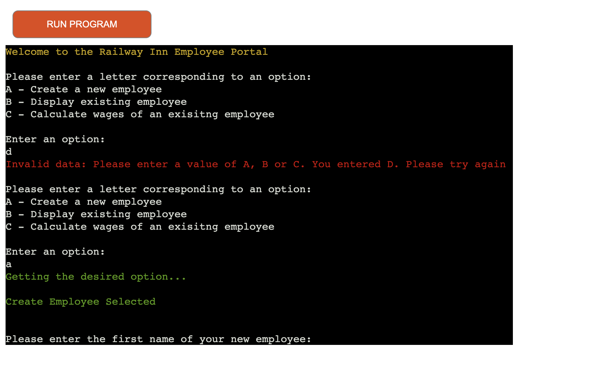

View the live site [here](https://railway-nn-employee-portal-da8a700a2d95.herokuapp.com/)

The Railway Inn are an independent pub company based in the West-Midlands, United Kingdom. Having recently changed ownership, the new owners are looking to grow the business and take it to new heights. With an influx of new hires, it has become clear to the owners that the current pen & paper method of handling the books simply isn't going to suffice to the scale they are aiming for. In turn, the new Railway Inn Employee Portal aims to automize this process for the owners, whereby they can enter employee details onto a databse, as well as calculate the wages for the employees. 

# Contents

- [Introduction](#introduction)
- [Project](#project)
  - [User goals:](#user-goals)
  - [Site owner goals](#site-owner-goals)
- [Pre development](#pre-development)
- [Development](#development)
- [Features](#features)
  - [Welcome Page & Main Menu](#welcome-page--main-menu)
  - [Create New Employee](#create-new-employee)
  - [Review Create Employee](#review-create-employee)
  - [Push New Employee](#push-new-employee)
  - [Display Existing Employee](#display-employee)
  - [Calculate Employee Pay](#calculate-employee-pay)
  - [Push Employee Pay](#push-employee-pay)
  - [Return to Main Menu](#return-to-main-menu)
  - [Error Validation](#error-validation)
  - [Exit Application](#exit-application)
- [Google Sheets](#google-sheets)
  - [Employees](#employees)
  - [Taxes](#taxes)
- [Technologies Used](#technologies-used)
- [Resources](#resources)
  - [Libraries](#libraries)
- [Testing](#testing) 
- [Validation](#validation)
- [Deployment](#deployment)
  - [Heroku](#heroku)
  - [Branching the GitHub Repository using GitHub Desktop and Visual Studio Code](#branching-the-github-repository-using-github-desktop-and-visual-studio-code)
- [Bugs](#bugs)
- [Credits](#credits)
- [Acknowledgements](#acknowledgements)

# Introduction

The Railway Inn Employee Portal allows employees of the Railway Inn to view their expected pay based off of the hours that thwy have worked within a given pay period. Similtaneously, both the gross-pay and net-pay will be pushed to a Google Sheets document for the benefit of HR.  The portal allows HR to create employee profiles within the portal which will allow easy access to key information of any given employee with no hassle.

# Project

- The aim of this project is to:
    - Allows the manager a way of accessing employee data with the click of a button
    - Save time for the manager of the Railway Inn by automatically calculating pay
    - Accesses contracted hours and calculates pay for a given employee
    - Allows employees of the Railway Inn a way of accessing their expected gross and net pay
    - Provides clear instructions of how to utilise the employee portal

## User Goals

The user will be able to access their expected pay through the employee portal prior to getting paid by the Railway Inn.

## Site Owner Goals

With the recent change of ownership of the Railway Inn, the new owners see it fit to implement an employee portal which will halve the workload of the pub-mamager. Here the manager (site owner) will be able to create an employee profile for any new employee that joins the business through following simple instructions and entering inputs. Upon confirmation of the amount of hours worked by an amployee, the manager will be able to use the employee portal to calculate the expected pay of any given employee granted they exist in the database.

# Pre-Development

I drafted up a flowchart on pen and paper so that I could visualise how my project was going to run. This helped me massively in thinking of the functions that I would need and just the overall logic of the application.

I decided that I would use [LucidChart](https://www.lucidchart.com/) to tidy-up my flowchart so that it had a better presentation to it, as well as aesthetic. If it was easier to read and interpret, then my code would only benefit from it!

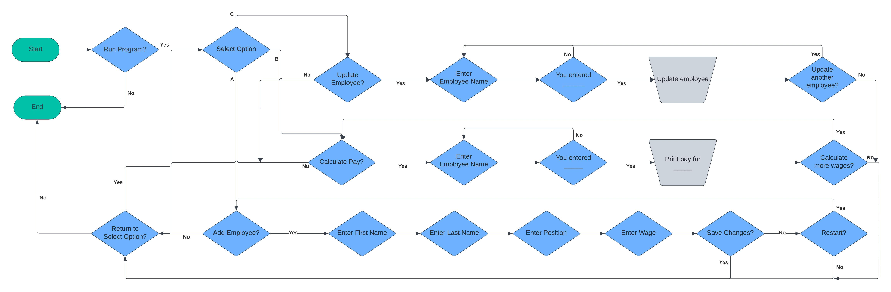

# Development

I have designed the project following the flowchart that I drafted. I coded the project step by step, focusing on one branch of the employee portal at a time. This would limit the amount of errors by simplifying the work load for myself as I would only be focusing on one aspect of the portal at any given time.

Granted, while testing, it did become apparent that there were underlying errors and bugs within all branches of the application. However; I figured that it was best to get the skeleton of my portal coded first, and then after making a note of the bugs I could then go ahead and fix them at a later date.

# Features

## Welcome Page & Main Menu
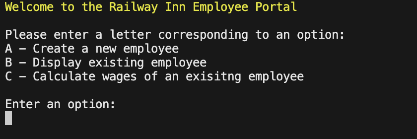

- Here the user is greeted with a welcome message. The user is able to enter 1 of 3 options, as seen above.

## Create New Employee

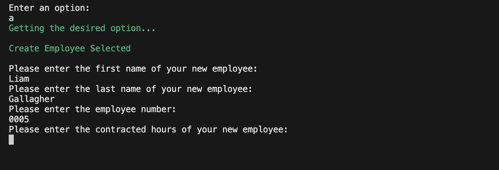

- Upon selecting Option A, the user will be able to create an employee within the Employee Database. The terminal takes multiple fields, all requesting key information regarding the individual.

## Review Create Employee

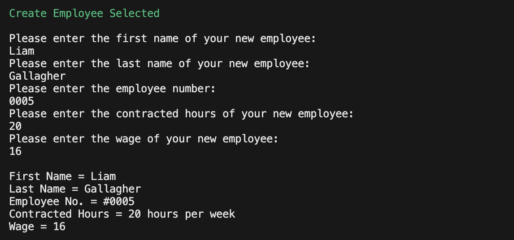

- The information inputed into the terminal will be read back to the user, and if the user is unhappy with the information provided, in the event of a typo, they will be able to reset the terminal and re-enter the information.

## Push New Employee

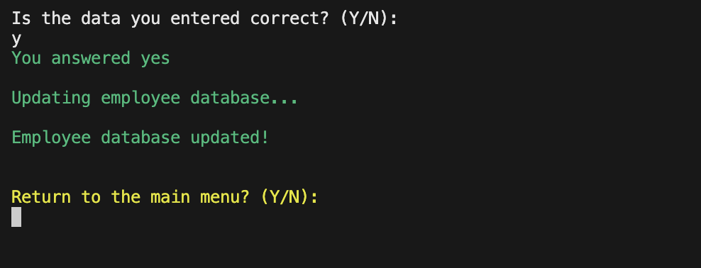

- However, if the user is happy that all the information is correct, they will then be able to push the data provided to a Google Sheet housing the Employee Database.

## Display Employee

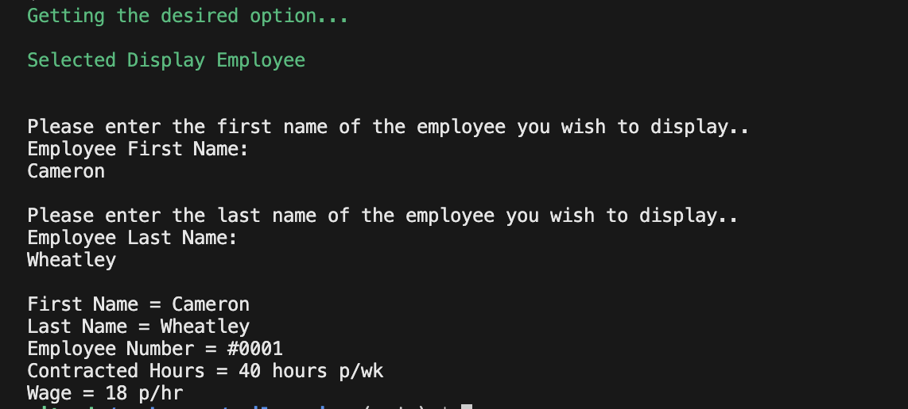

- The second option that the user can select is display employee. This option will fetch exisitng data from the aforementioned Employee Database and display it to the user in the terminal.

## Calculate Employee Pay

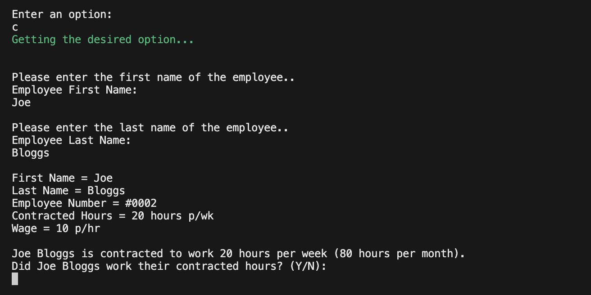

- The third option that the user can select is calculate employee pay. This option will ask the user for an existing employee who's pay they want to calculate, it is will print the gross pay, net pay amd taxes to the console.

## Push Employee Pay

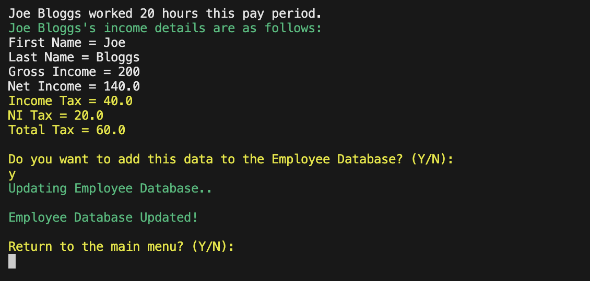

- Upon calculating the employee's pay, the user is given the option to push this data to the Employee Database. This will update the Google Sheets Employee Database with the pay and taxes the user has just calculated in the terminal.

## Return to Main Menu

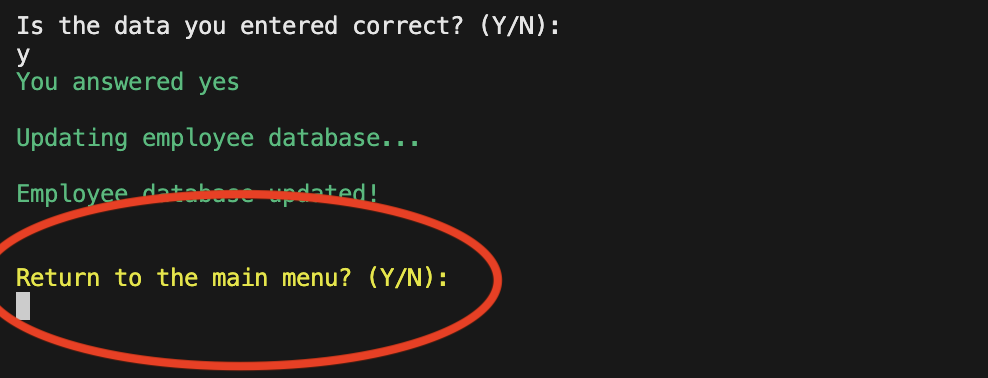

- At the end of each branch, the user will be given the option to return to the main menu. This providing conveniance for the user as they do not have to refresh the application. It also allows the user to transverse from branch to branch without resetting the application.

## Error Validation

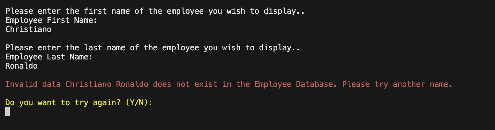

- Multiple instances of validation have been added into the Employee Database to make life as simple and stress-free as possible for the user. The terminal will raise an error if the specific input is not implemented, or the user attempts to search for an employee that is not in the database.
- On top of this, the programme will continue to run in the event of an error without the user having to reset the application.

## Exit Application

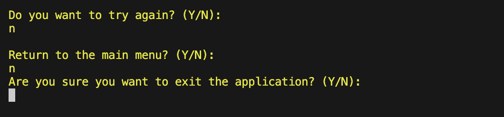

- Throughout the application, the user is given the choice to exit out of the application if they choose to. This simple feature ties the application together and makes it feel complete, as oppose to abruptly closing.

# Google Sheets

It was always my original intention to use Google Sheets in conjunction with this Python project. Through updating the Google Sheets outlined below, the user will find great convienience in using the Employee Portal.

Initially I wanted to inclue a 'rota' sheet which would outline the rota for the following week/month, and this would be used to calculate the wages of the employees. However this proved to be too complicated when considering overtime that employees worked, or shifts that were missed for various reasons. It therefore made sense for the user to input hours worked manually. 

## Employees

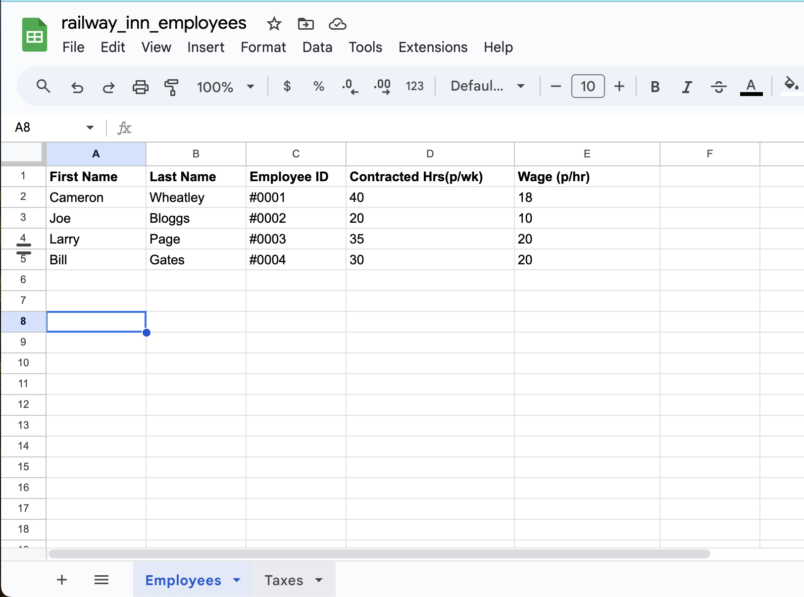

- The employee page of the Employee Database displays the following parameters:
  - First Name
  - Last Name
  - Employee Number
  - Contracted Hours per Week
  - Wage per Hour

## Taxes

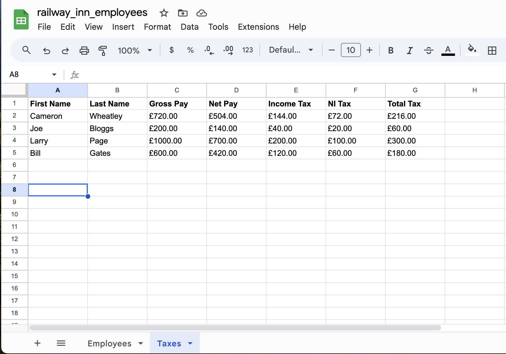

- The taxes page of the Employee Database displays the following parameters:
  - First Name
  - Last Name
  - Gross Income
  - Net Income
  - Income Tax
  - National Insurance Tax
  - Total Tax

The Employee Database is stored on an on-site computer within the Railway Inn where they can access the information uploaded to it.

# Technologies Used

- Python is the main technology that has been used to create the terminal window.
- Google Sheets has been used to create and house the Employee Database.
- Google Sheets API has been used to in order to push and fetch data to and from the Employee Database.

# Resources

- Visual Studio Code (VSCode)
- GitPod
- GitHub
- Heroku
- Slack
- LucidChart to create the flow chart
- W3Schools

## Libraries

- [colorama Fore & Back](https://pypi.org/project/colorama/)

- [OS](https://docs.python.org/3/library/os.html)

# Testing

Testing for the employee portal can be found [here](/TESTING.md)

# Deployment

### Heroku

The Application has been deployed from GitHub to Heroku by following the steps:

1. Create or log in to your account at heroku.com
2. Create a new app, add a unique app name ( for example corri-construction-p3) and then choose your region
3. Click on create app
4. Go to "Settings"
5. Under Config Vars add the private API key information using key 'CRED' and into the value area copy the API key information added to the .json file.  Also add a key 'PORT' and value '8000'.
6. Add required buildpacks (further dependencies). For this project, set it up so Python will be on top and Node.js on bottom
7. Go to "Deploy" and select "GitHub" in "Deployment method"
8. To connect Heroku app to your Github repository code enter your repository name, click 'Search' and then 'Connect' when it shows below.
9.  Choose the branch you want to build your app from
10. If preferred, click on "Enable Automatic Deploys", which keeps the app up to date with your GitHub repository
11. Wait for the app to build. Once ready you will see the “App was successfully deployed” message and a 'View' button to take you to your deployed link.

### Branching the GitHub Repository using GitHub Desktop and Visual Studio Code
1. Go to the GitHub repository.
2. Click on the branch button in the left hand side under the repository name.
3. Give your branch a name.
4. Go to the CODE area on the right and select "Open with GitHub Desktop".
5. You will be asked if you want to clone the repository - say yes.
6. GitHub desktop will suggest what to do next - select Open code using Visual Studio Code.

# Validation

The project has been validated with [pep8 validation service](https://pypi.org/project/pep8/). The validation report returned no errors, however warnings regarding line length were unable to be rectified due to bugs within in the code resulting from this.

# Bugs

- A current bug that I am unsure how to fix right now is the issue of the Employee Database not updating. If the user creates an employee account and then tries to display said employee, the terminal will throw an error as it is trying to read the data from a not-updated spreadsheet.
  - A way around this is by refreshing the terminal after pushing an employee; however this takes away from user experience.

# Credits

- The slice function taken from W3Schools helped me get an index of the column values. Taken from [here](https://www.w3schools.com/python/ref_func_slice.asp), however I ended up altering this code and getting rid of the slice function. 

- The Code Institute Tutoring Service who helped me create the 'not in' code within the letter and numeric validation functions.

- [This video](https://www.youtube.com/watch?v=u51Zjlnui4Y) helped me understand and implement the Colorama Import.

- The [pep8 validation service](https://pypi.org/project/pep8/) which I used and installed in order to validate my code.

- [This tutorial](https://www.codingninjas.com/studio/library/how-to-clear-a-screen-in-python) helped me utilise the OS Clear function within the os import library.

- I used [LucidChart](https://www.lucidchart.com/) to help me create a flowchart that helped me visualise how my code would run.

# Acknowledgements

- I would like to thank my mentor Jubril Akolade for providing me with such succinct advise and guidance during my mentor sessions. This project was made so much easier with the help of AJ as his methodology when it came to tackling this project.

- I would like to thank the Code Institute Slack Community for helping me find a way to deploy my project to Heroku after pretty considerable difficulties in the beginning.

- I would like to thank the Railway Inn, the local pub in my area, for inspiring me with this project and helping me find focus for this project. 