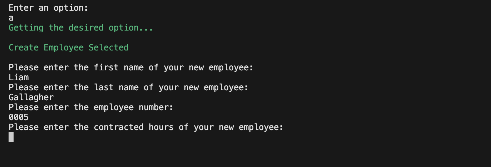

# The Railway Inn - Testing

View the live site [here](https://railway-nn-employee-portal-da8a700a2d95.herokuapp.com/)

# Contents
- [Introduction](#introduction)
- [Manual Testing](#manual-testing)
- [Browser Testing](#brower-testing)
- [Google Sheets Testing](#google-sheets-testing)
- [Future Updates](#future-updates)

## Introduction 

Once the portal was up and running with functionality, I began testing it for any potential and obscure errors so that in the event of catching any I was able to fix them.

I went into the Railway Inn to speak with the manager and go through the employee portal with him. We tested it by implementing the current employees into the portal, and we then calculated their gross pay using the relevent options. One issue that we found is that due to the way the code has been written when retrieving the index values from the database, the last employee on the spreadsheet is not calculated. I fixed this within the code through adding +1 to the index values. 

## Manual Testing

The following tests were carried out to ensure that the Employee Portal was working correctly

| Feature | Action | Expected Result | Actual Result |
| ------- | ------ | --------------- | ------------- |
| Select Option A | Entered 'A' | Displayed Create New Employee | Worked as expected | 
| Select Option B | Entered 'B' | Displayed Display Employee | Worked as expected |
| Select Option C | Entered 'C' | Displayed Calculate Pay | Worked as expected | 
| Select Option | Entered 'D' | Raise Value Error | Worked as expected |
| Select Option | Entered '1' | Raise Value Error | Worked as expected |
| Name Input | Entered 'Cam' | Accepted Input | Worked as expected |
| Name Input | Entered number & special character | Raise Value Error | Worked as expected |
| Hour/Wage Input | Entered number | Accepted Input | Worked as expected |
| Hour/Wage Input | Entered letter & special character | Raise Value Error | Worked as expected |
| Review Input | Entered 'Y'/'N' | Displayed relevent outcome | Worked as expected |
| Review Input | Entered other letter, number, space & special character | Raise Value Error | Worked as Expected |
| Push to Google Sheets | Submitted Employee Details | Appended row in Google Sheets | Worked as expected |
| Return to Main Menu | Entered 'Y'/'N' | Displayed Relevent Outcome | Worked as expected |
| Return to Main Menu | Entered other letter, number, space & special character | Raise Value Error | Worked as Expected |
| Exit Application | Entered 'Y'/'N' | Displayed Relevent Outcome | Worked as expected |
| Ext Application | Entered other letter, number, space & special character | Raise Value Error | Worked as Expected |
| Try Again Input | Entered 'Y'/'N' | Displayed Relevent Outcome | Worked as expected |
| Try Again Input | Entered other letter, number, space & special character | Raise Value Error | Worked as Expected |
| Display Employee Pay Details | Enter relevent info | Displayed employee pay details | Worked as expected |
| Hours Confirmation | Entered 'Y'/'N' | Displayed Relevent Outcome | Worked as expected |
| Hours Confirmation | Entered other letter, number, space & special character | Raise Value Error | Worked as Expected |
| Push Pay Data | Submitted Employee Pay Details | Appended row to Google Sheet | Worked as expected |

## Brower Testing

The Employee Portal was tested in the following browsers:

| Browser | Action | Expected Result | Actual Result | Pass |
| ------- | ------ | --------------- | ------------- | ---- |
| Chrome | Select Option B | Show display Employee |  | Y |
| Safari | Select Option A | Show Create Employee |  | N - Employee Portal in unresponsive in Safari |
| Firefox | Select Option C | Show Calculate Employee Pay |  | Y |
| Edge | Select Option A | Show Create Employee |  | Y |

## Google Sheets Testing

A great deal of testing has been conducted regarding pushing data to the Google Sheets Employee Database.

There are only two instances within the code where data is pushed from the termianl to the Google Sheets so thorough testing was able to be carried out.

| Feature | Action | Expected Result | Actual Result | Pass |
| ------- | ------ | --------------- | ------------- | ---- |
| Create New Employee |  | New employee data pushed to the Employee Database |  | Y |
| Calculate Pay |  | Calculated pay data pushed to the employee database |  | Y |

## Future Updates

After speaking with the manager of the Railway Inn, upon testing the portal together we have discussed potential future updates that could really improve the overall functionality of the employee portal. 

- The first feature that we concluded was the option to delete an employee from the database which in doing so would then delete the employee from the Google Database too. This would ad more value to the portal asit would mean the manager would not have to manually delete from the Google Sheet.

- The second feature that we discussed was the ability to update an employee on the portal which would then update on the Google Database too. For example, if an employee were to gain a promotion and get a wage increase, or an employee were to alter their contracted hours, there is currently no way of updating this through the portal. 

- Finally, we discussed the ability of having a third page on the Google Database where the manager is able to upload the weekly rota for the employees. Then through accessing this rota, the portal is able to calculate the employee's pay without the manager having to input the hours that the employees have worked.